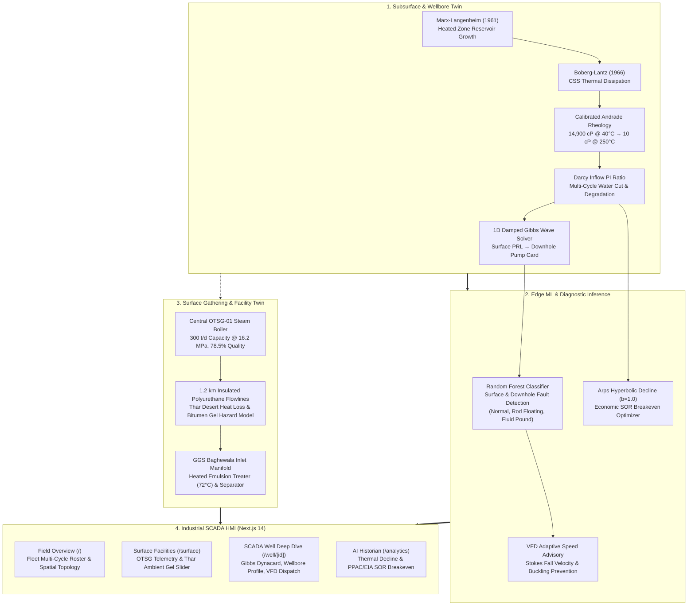

# Digital Twin for Well-to-Surface Optimization (SIH-26120)

### Cyclic Steam Stimulation (CSS) & Sucker Rod Pump (SRP) Operations — Baghewala Heavy Oil Field, Oil India Limited

[](http://localhost:3000)
[](https://nextjs.org/)
[](https://fastapi.tiangolo.com/)
[](https://onepetro.org/)

---

## 📌 Executive Summary

This repository contains the enterprise **Well-to-Surface Digital Twin** engineered for the **Smart India Hackathon (SIH Problem Statement 26120)**. 

The platform optimizes **Cyclic Steam Stimulation (CSS)** and **Sucker Rod Pumping (SRP)** for ultra-heavy asphaltic crude (~10,000–50,000 cP, 9–12° API) in the **Baghewala Field (Jodhpur Sandstone formation, Bikaner-Nagaur Basin, Rajasthan)** operated by **Oil India Limited (OIL)**.

Unlike typical demo dashboards, this system couples **subsurface reservoir thermodynamics**, **downhole rod string wave mechanics**, and **surface gathering/pipeline transport** into an end-to-end, high-frequency SCADA HMI.

---

## 🏗️ System Architecture



---

## 🔬 Core Physics & Mathematical Formulations

### 1. Marx-Langenheim (1961) Heated Reservoir Area
Calculates heated zone area accounting for heat loss to overburden and underburden rock:
$$A(t) = \frac{H_0 \cdot \rho_c \cdot h_t}{4 k_h^2 \Delta T_f} \left[ e^{t_D} \operatorname{erfc}(\sqrt{t_D}) + 2\sqrt{\frac{t_D}{\pi}} - 1 \right]$$
Where $t_D$ is dimensionless time:
$$t_D = \frac{4 k_h \rho_c t}{(\rho_c h_t)^2}$$

### 2. Boberg-Lantz (1966) CSS Temperature Decline
Predicts reservoir cooling during the production phase of CSS:
$$T(t) = T_{\text{reservoir}} + (T_{\text{initial}} - T_{\text{reservoir}}) \exp\left(-\frac{t}{\tau}\right)$$

### 3. Calibrated Baghewala Heavy Oil Rheology
Calibrated to published experimental data for Jodhpur Sandstone crude (9–12° API):
$$\mu(T) = 1.842 \times 10^{-4} \cdot \exp\left(\frac{5704}{T_K}\right)$$
- **40°C (Reservoir datum):** **~14,900 cP** (immobile bitumen).
- **100°C (Mid-production):** **~810 cP**.
- **250°C (Steam saturation):** **~10 cP** (flowing mobile liquid).

### 4. 1D Damped Gibbs Wave Equation (Surface $\to$ Downhole Pump Card)
Reconstructs the downhole pump card from surface polished rod loads, taking into account elastic rod elongation and acoustic damping:
$$\frac{\partial^2 u}{\partial t^2} = a^2 \frac{\partial^2 u}{\partial x^2} - c \frac{\partial u}{\partial t}$$
Downhole stroke calculates rod stretch $S = \frac{F_{\text{fluid}}}{K_{\text{rod}}}$ with $K_{\text{rod}} = 30,000\text{ lb/in}$, isolating traveling valve vs standing valve load transfer.

### 5. Arps Hyperbolic Decline & Economic SOR Cutoff
Models heavy oil thermal recovery ($b = 1.0$ harmonic decline standard for thermal CSS):
$$q(t) = \frac{q_0}{1 + b \cdot D_i \cdot t}$$
$$\text{SOR}_{\text{cutoff}} = \frac{\text{PPAC Indian Crude Basket Price (\$/bbl)}}{\text{EIA Steam Generation Cost (\$/ton)}} \approx 3.16\text{ tons/bbl}$$
When real-time SOR crosses $\text{SOR}_{\text{cutoff}}$, the digital twin automatically advises halting SRP pumping and initiating the next steam re-injection cycle.

---

## 💻 Tech Stack

| Tier | Technologies |
|---|---|
| **Frontend** | Next.js 14 (App Router), React, TypeScript, Tailwind CSS, Lucide Icons, Recharts, Custom High-Performance SVG Canvas |
| **Backend** | Python 3.12, FastAPI, WebSockets, Uvicorn, Pydantic v2 |
| **ML & Physics** | Scikit-Learn (Random Forest), NumPy 2.x, SciPy (`erfc`), Joblib |
| **Telemetry Protocol** | 60 Hz Full-Duplex WebSockets (`ws://127.0.0.1:8000/ws/telemetry`) |

---

## 🚀 Quick Start Guide

### Prerequisites
- Python 3.10+
- Node.js 18+ and npm

### 1. Clone & Set Up Backend
```bash
git clone https://github.com/Ashish-331/sih-baghewala-digital-twin.git
cd sih-baghewala-digital-twin/backend

# Set up virtual environment
python3 -m venv venv
source venv/bin/activate
pip install -r requirements.txt # or install fastapi uvicorn pydantic scikit-learn numpy scipy requests joblib

# Run backend API + simulation replay engine
chmod +x run.sh
./run.sh
```

### 2. Set Up Frontend
```bash
cd ../frontend
npm install
npm run dev
```

Open [http://localhost:3000](http://localhost:3000) in your browser.

---

## 🖥️ Application Features & Routes

- **`/` — Fleet Supervisory Overview:** Real-time multi-cycle fleet status (Cycles 1, 2, 4), spatial pipeline gathering topology, live water cut, daily net margin, and active anomaly alerts.
- **`/surface` — Surface Facilities & Flowline Twin:** Central OTSG Boiler telemetry (285 t/d, 16.2 MPa), Thar Desert ambient temperature slider (5°C to 48°C) simulating winter night bitumen flowline gel hazards, and GGS gathering separator readouts.
- **`/well/[id]` — SCADA Wellbore Deep Dive:** Tabbed dual-view featuring:
  1. *Gibbs 1D Dynacard Analysis:* High-fidelity SVG dual-trace (Surface PRL vs. Downhole Pump Card) with live work integration ($W = \oint F dx$).
  2. *Subsurface Wellbore Profile:* Completion diagram with dynamic temperature $T(z)$ and viscosity $\mu(z)$ gradient curves.
  3. *Closed-Loop VFD Advisory:* Auto vs. Manual override with What-If SPM stress simulator and setpoint dispatch (`POST /api/setpoint`).
- **`/analytics` — AI Historian & Economic Optimizer:** Arps Hyperbolic decline curve with interactive PPAC Crude & EIA Steam sliders for real-time breakeven inflection point determination.

---

## ⚖️ Disclaimer

*ILLUSTRATIVE - UNCALIBRATED.* Synthetic simulation data and physics models are calibrated to generic published petroleum literature for the Baghewala Field analog (Oil India Ltd.). Not for live operational field deployment without site-specific field sensor calibration.
